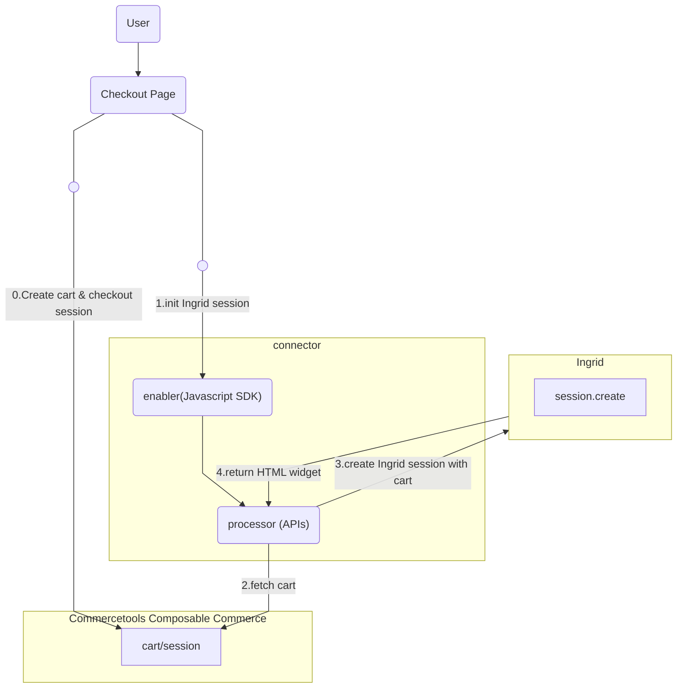

# connect-shipping-integration-ingrid
This repository provides a [connect](https://docs.commercetools.com/connect) for integration to Ingrid delivery solution provider.

## Features
- Typescript language supported.
- Uses Fastify and Express as web server framework in different modules.
- Uses [commercetools SDK](https://docs.commercetools.com/sdk/js-sdk-getting-started) for the commercetools-specific communication.
- Includes local development utilities in npm commands to build, start, test, lint & prettify code.

## Overview
The Ingrid-integration connector contains three modules :  
- Enabler: Acts as a wrapper implementation in which frontend components from Ingrid embedded. It gives control to checkout product on when and how to load the connector frontend based on business configuration. In cases connector is used directly and not through Checkout product, the connector library can be loaded directly on frontend than the PSP one.
- Processor : Acts as backend services which is middleware to integrate with Ingrid platform. It is mainly responsible for managing session initialized in Ingrid platform and updating cart entity in composable commerce.  Also the request context, commercetools checkout sessions and other tools necessary to transact are all maintained inside this module.
- Event Handler: As named, it provides a handling to manage event messages from commercetools composable commerce in asynchronous mode. The connector subscribes order creation event in commercetools composable commerce and use it to complete Ingrid session in the delivery platform as well as changing shipment state for commercetools order.

### Intial Flow

0. It is supposed that merchant creates the cart and [checkout session](https://docs.commercetools.com/checkout/installing-checkout#create-checkout-sessions) in commercetools composable commerce.
1. commercetools Checkout retrieves SDK as static assets from `enabler` in connector. After downloading the SDK, commercetools Checkout sends request via the SDK to endpoints exposed by processor to trigger Ingrid session initialization.
2. The processor fetches the latest cart from commercetools composable commerce by the provided commercetools checkout session.
3. Ingrid receives the cart details from the processor and initialize an Ingrid session.
4. Ingrid platform returns HTML snippet of the widget, which contains a form for filling shipping address and shipping options. The HTML snippet is returned back to frontend checkout page for display purpose.
