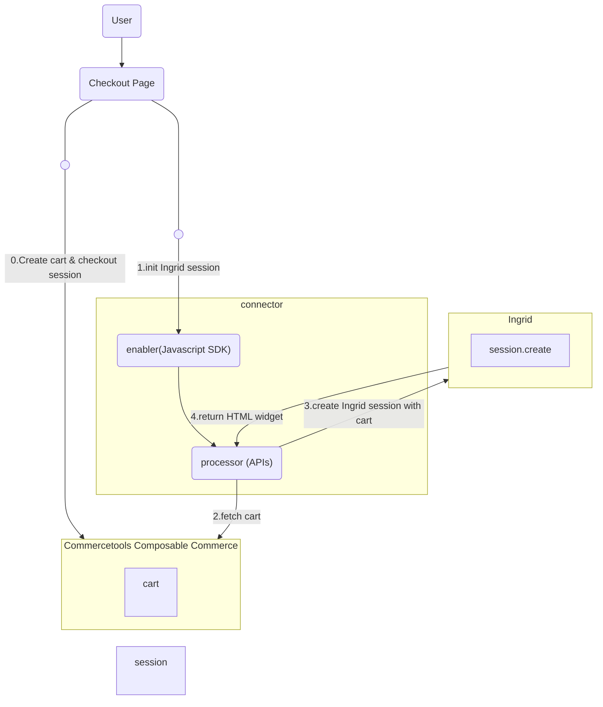
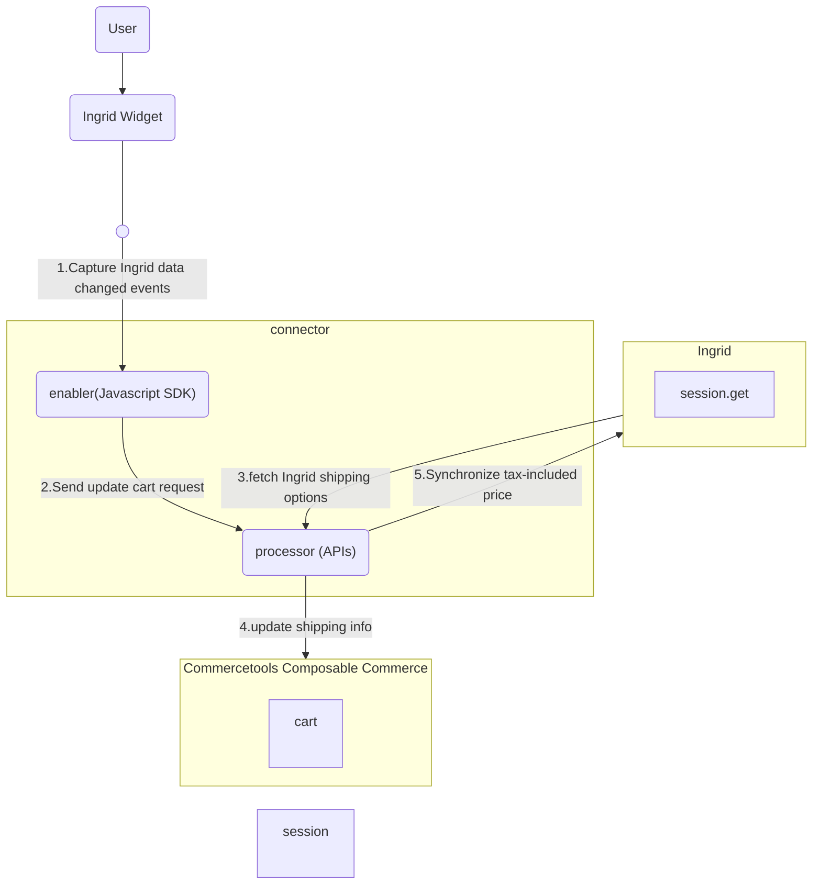
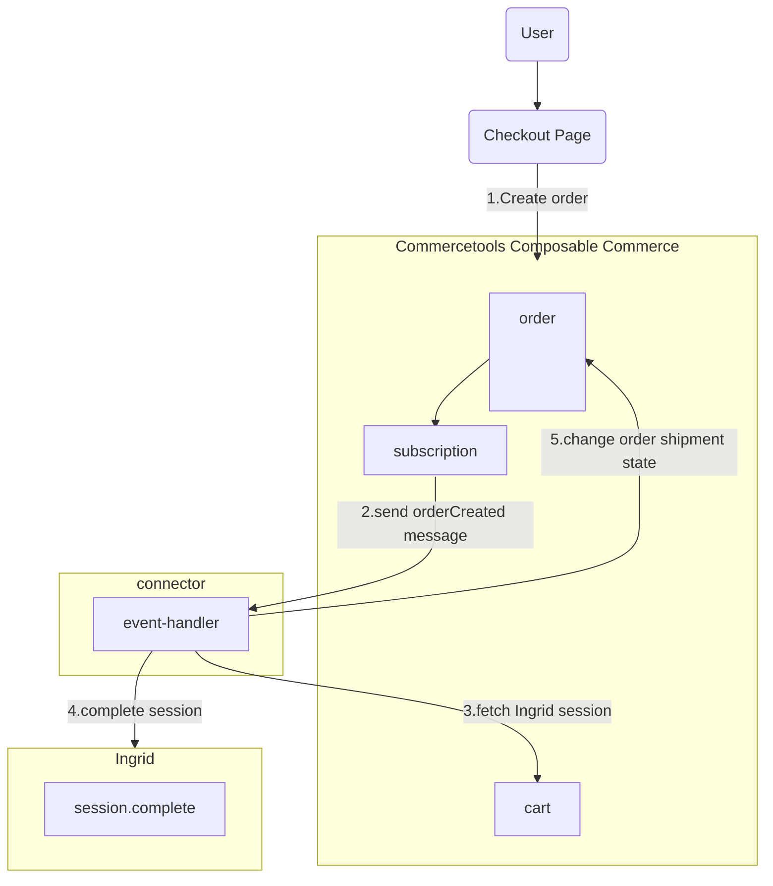

# connect-shipping-integration-ingrid

This repository provides a [connect](https://docs.commercetools.com/connect) for integration to Ingrid delivery solution provider.

- [Features](#Features)
- [How to install](#how-to-install)
- [Overview](#Overview)
- [Prerequisite](#Prerequisite)
- [Development Guide](#development-guide)
- [Best Practice](#best-practice)

## Features

- Typescript language supported.
- Uses Fastify and Express as web server framework in different modules.
- Uses [commercetools SDK](https://docs.commercetools.com/sdk/js-sdk-getting-started) for the commercetools-specific communication.
- Displays Ingrid widget in a single iFrame including both shipping address form and shipping options form.
- Pre-filled address is included in the Ingrid widget if shipping address is provided during commercetools cart is created.
- Applies retry logic on the communication between the connector and Ingrid platform.
- Supports real time shipping address and shipping options synchronization from the Ingrid platform to the cart in commercetools composable commerce when user interacts with the Ingrid widget.
- Supports single shipment per order.
- The shipment options provided by Ingrid platform are independent of line items weights and sizes.
- The cart details submitted to Ingrid platform is independent of Ingrid discount coupons.
- Includes local development utilities in npm commands to build, start, test, lint & prettify code.

## How to Install

1. Create Connect application and install Ingrid connector in connect
2. Create commercetools composable commerce API client for connector to set as configuration values

   - `CTP_PROJECT_KEY`
   - `CTP_CLIENT_ID`
   - `CTP_AUTH_URL`
   - `CTP_API_URL`
   - `CTP_CLIENT_SECRET`

3. Create Ingrid API key to set as configuration values

   - `INGRID_API_KEY`
   - `INGRID_ENVIRONMENT`

4. Optionally set cart custom type key and/or Tax category
   1. Optionally set cart custom type key in `INGRID_SESSION_CUSTOM_TYPE_KEY` if if already exists, if not provided connector will automatically create it
   2. Optionally set Tax category in `INGRID_SPECIFIC_TAX_CATEGORY_KEY` if tax configuration already exists for shipping, if not provided connector will automatically create it
5. Deploy on connect
6. Once connect deployment is successful, store URL for Enabler and Processor applications as `VITE_ENABLER_URL` and `VITE_PROCESSOR_URL` respectively in an `.env` file or as configurations in your frontend CI/CD
7. Follow [Usage guidance](./enabler/README.md#usage) to integrate connector in your frontend

## Overview

The Ingrid-integration connector contains three modules :

- Enabler: Acts as a wrapper implementation in which frontend components from Ingrid embedded. It gives control to checkout product on when and how to load the connector frontend based on business configuration. In cases connector is used directly and not through Checkout product, the connector library can be loaded directly on frontend instead of communicating with Ingrid platform from fronted.
- Processor : Acts as backend services which is middleware to integrate with Ingrid platform. It is mainly responsible for managing session initialized in Ingrid platform and updating cart entity in composable commerce. Also the request context, commercetools checkout sessions and other tools necessary to transact are all maintained inside this module.
- Event Handler: It processes event messages from commercetools composable commerce in asynchronous mode. The connector subscribes order creation event in commercetools composable commerce and uses it to complete the delivery session in the Ingrid platform followed by changing shipment state for commercetools order.

### Intial Flow



0. It is supposed that merchant creates the cart and [checkout session](https://docs.commercetools.com/checkout/installing-checkout#create-checkout-sessions) in commercetools composable commerce before initialize delivery session on Ingrid platform.
1. commercetools Checkout retrieves SDK as static assets from `enabler` in connector. After downloading the SDK, commercetools Checkout sends request via the SDK to endpoints exposed by `processor` to trigger Ingrid session initialization.
2. The `processor` fetches the latest cart from commercetools composable commerce by the provided commercetools checkout session.
3. Ingrid receives the cart details from the `processor` and initialize a delivery session on Ingrid platform.
4. Ingrid platform returns HTML snippet of the widget, which contains a form for filling shipping address and shipping options. The HTML snippet is returned back to frontend checkout page for display purpose.

### Update Flow



1. The `enabler` capture Ingrid events when user interacts with Ingrid widget. If address changed and shipping method changed events have been captured, the `enabler` sends update cart request to the `processor`.
2. The `processor` fetches the up-to-date shipping info from the Ingrid platform collected through the widget.
3. Shipping info is saved to the cart in commercetools composable commerce.
4. If the price stored in the Ingrid platform is different from the tax-included price in commercetools cart, this price is sychronized to the Ingrid platform.

### Completion Flow



1. commercetools Checkout sends request of order creation to commercetools composable commerce, and subscription listens to order creation event.
2. The commercetools subscription sends message containing order ID to the `eventHandler` inside connector.
3. The `eventHandler` makes use the order ID to fetch the Ingrid session ID stored inside the cart as custom field.
4. The `eventHandler` sends request with the the Ingrid session ID to Ingrid platform to complete the delivery session.
5. The `eventHandler` change the shipment state inside the cart to either `ready` or `canceled` based on the result of delivery session completion.

## Important Notes
- The connector supports Ingrid voucher codes input. If voucher codes are inputted or modified in the merchant checkout page after Ingrid shipping component has been rendered, it is necessary to reinvoke init() provided by the Enabler. For details about Enabler functions, please read [Usage](./enabler/README.md#usage)

- To support the cart item dimension and weight, the connector supposes the dimension can be obtained as product variant attributes `height`, `weight` and `length` in millimeter unit from commercetools project, while the weight is supposed to be found as product variant attribute `weight` in gram unit.

## Prerequisite

#### 1. commercetools composable commerce API client

Users are expected to create API client responsible for cart management in composable commerce project. Details of the API client are taken as input as environment variables/ configuration for connect such as `CTP_PROJECT_KEY` , `CTP_CLIENT_ID`, `CTP_CLIENT_SECRET`. In addition, please make sure the API client should have enough scope to be able to manage checkout session, cart, order and other commercetools resources. For details, please read [Deployment Configuration](./README.md#deployment-configuration).

#### 2. various URLs from commercetools composable commerce

Various URLs from commercetools platform are required to be configured so that the connect application can handle session and authentication process for endpoints.
Their values are taken as input as environment variables/ configuration for connect with variable names `CTP_API_URL`, `CTP_AUTH_URL` and `CTP_SESSION_URL`.

#### 3. Ingrid API credentials

Various account data provided by Ingrid are necessary to be configured so that the requests from the connect application can be authenticated by Ingrid platform within the integration.
Their values are taken as input as environment variables/ configuration for connect with variable names `INGRID_ENVIRONMENT`, `INGRID_API_KEY`.

#### 4. Keys of commercetools composable commerce resources

The connector requires tax category and custom type defined in commercetools composable commerce project. The key of these resources can be input as environment variables/ configuration for connect with variable names `INGRID_SESSION_CUSTOM_TYPE_KEY`, `INGRID_SPECIFIC_TAX_CATEGORY_KEY`.

## Development Guide

Regarding the development of enabler module, please refer to the following documentations:

- [Development of Enabler](./enabler/README.md)

Regarding the development of processor module, please refer to the following documentations:

- [Development of Processor](./processor/README.md)

Regarding the development of processor module, please refer to the following documentations:

- [Development of Event Handler](./event-handler/README.md)

#### Deployment Configuration

In order to deploy your customized connector application on commercetools Connect, it needs to be published. For details, please refer to [documentation about commercetools Connect](https://docs.commercetools.com/connect/concepts)
In addition, in order to support connect, the ingrid shipping integration connector has a folder structure as listed below

```
├── enabler
│   ├── src
│   ├── test
│   └── package.json
├── processor
│   ├── src
│   ├── test
│   └── package.json
├── event-handler
│   ├── src
│   ├── test
│   └── package.json
└── connect.yaml
```

Connect deployment configuration is specified in `connect.yaml` which is required information needed for publishing of the application. Following is the deployment configuration used by enabler, processor and event-handler modules

```yaml
deployAs:
  - name: enabler
    applicationType: assets
  - name: processor
    applicationType: service
    endpoint: /
    scripts:
      postDeploy: npm install && npm run connector:post-deploy
      preUndeploy: npm install && npm run connector:pre-undeploy
    configuration:
      standardConfiguration:
        - key: CTP_PROJECT_KEY
          description: commercetools project key
          required: true
        - key: CTP_CLIENT_ID
          description: commercetools client ID
          required: true
        - key: CTP_AUTH_URL
          description: commercetools Auth URL
          required: true
          default: https://auth.europe-west1.gcp.commercetools.com
        - key: CTP_API_URL
          description: commercetools API URL
          required: true
          default: https://api.europe-west1.gcp.commercetools.com
        - key: CTP_SESSION_URL
          description: Session API URL
          required: true
          default: https://session.europe-west1.gcp.commercetools.com
        - key: INGRID_ENVIRONMENT
          description: Ingrid environment (STAGING or PRODUCTION)
          required: true
          default: STAGING
        - key: INGRID_SESSION_CUSTOM_TYPE_KEY
          description: Key of CustomType to store ingrid session inside cart
          required: false
          default: ingrid-session
        - key: INGRID_SPECIFIC_TAX_CATEGORY_KEY
          description: Key of TaxCategory to be used for shipping tax calculation
          required: false
          default: ingrid-tax
        - key: INGRID_SHIPPING_CUSTOM_TYPE_KEY
          description: Key of CustomType to store transport order ID after order has been created
          required: false
          default: ingrid-shipping
      securedConfiguration:
        - key: INGRID_API_KEY
          description: the key used to connect to the Ingrid instance
          required: true
        - key: CTP_CLIENT_SECRET
          description: commercetools client secret
          required: true
  - name: event-handler
    applicationType: event
    endpoint: /
    scripts:
      postDeploy: npm install && npm run connector:post-deploy
      preUndeploy: npm install && npm run connector:pre-undeploy
    configuration:
      standardConfiguration:
        - key: CTP_PROJECT_KEY
          description: commercetools project key
          required: true
        - key: CTP_CLIENT_ID
          description: commercetools client ID
          required: true
        - key: CTP_AUTH_URL
          description: commercetools Auth URL
          required: true
          default: https://auth.europe-west1.gcp.commercetools.com
        - key: CTP_API_URL
          description: commercetools API URL
          required: true
          default: https://api.europe-west1.gcp.commercetools.com
        - key: INGRID_ENVIRONMENT
          description: Ingrid environment (STAGING or PRODUCTION)
          required: true
          default: STAGING
        - key: INGRID_SHIPPING_CUSTOM_TYPE_KEY
          description: Key of CustomType to store transport order ID after order has been created
          required: false
          default: ingrid-shipping
      securedConfiguration:
        - key: INGRID_API_KEY
          description: the key used to connect to the Ingrid instance
          required: true
        - key: CTP_CLIENT_SECRET
          description: commercetools client secret
          required: true
```

Here you can see the details about various variables in configuration

- `CTP_PROJECT_KEY`: The key of commercetools composable commerce project.
- `CTP_CLIENT_ID`: The client ID of your commercetools composable commerce user account. It is used in commercetools client to communicate with commercetools composable commerce via SDK. Expected scopes are: `manage_orders` `manage_sessions` `view_api_clients` `introspect_oauth_tokens`
`manage_tax_categories` `view_project_settings` `manage_subscriptions` `manage_types`.
- `CTP_CLIENT_SECRET`: The client secret of commercetools composable commerce user account. It is used in commercetools client to communicate with commercetools composable commerce via SDK.
- `CTP_AUTH_URL`: The URL for authentication in commercetools platform. It is used to generate OAuth 2.0 token which is required in every API call to commercetools composable commerce. The default value is `https://auth.europe-west1.gcp.commercetools.com`. For details, please refer to documentation [here](https://docs.commercetools.com/tutorials/api-tutorial#authentication).
- `CTP_API_URL`: The URL for commercetools composable commerce API. Default value is `https://api.europe-west1.gcp.commercetools.com`.
- `CTP_SESSION_URL`: The URL for session creation in commercetools platform. Connectors relies on the session created to be able to share information between enabler and processor. The default value is `https://session.europe-west1.gcp.commercetools.com`.
- `INGRID_ENVIRONMENT`: It represents the environment of Ingrid platform to communicate with the connector. It can be either `STAGING` or `PRODUCTION`.
- `INGRID_API_KEY`: The key used to connect to the Ingrid instance. When connector communicates with Ingrid platform, this key becomes a token inside request header for authentication done by Ingrid endpoints.
- `INGRID_SESSION_CUSTOM_TYPE_KEY`: It represents the key of the `customType` defined in commercetools composable commerce. If the commercetools project itself has already defined a `customType` with `order` as its `resourceTypeIds`, the key of this `customType` can be provided to the connector. Our connector creates a field definition `ingridSessionId` and `ingridExtMethodId` if they don't exist in the `customType`. This custom field definition represents a non-required string type which allows the commercetools cart to store the value of delivery session ID generated by Ingrid platform. If the key of the `customType` is not provided, the connector will create a new `customType` for customer with a pre-defined key `ingrid-session`.
- `INGRID_SPECIFIC_TAX_CATEGORY_KEY`: It represents the key of the `taxCategory` defined in commercetools composable commerce. If the commercetools project itself has already defined a `taxCategory`, the key of this `taxCategory` can be provided to the connector. This tax category is used for applying tax on the shipping cost. If the value of this configuration is not provided, the connector will create a new `taxCategory` for customer with a pre-defined key `ingrid-tax`.
- `INGRID_SHIPPING_CUSTOM_TYPE_KEY`: It represents the key of the `customType` defined in the commercetools composable commerce. If the commercetools project itself has already defined a `customType` with `shipping` as its `resourceTypeIds`. the key of this `customType` can be provided to the connector. Our connector creates a field definition `ingridTransportOrderId` if it doesn't exist in the `customType`. This custom field definition represents a non-required string type which allows the commercetools order to store the value of transport order ID generated by Ingrid platform when Ingrid session has been completed. If the key of the `customType` is not provided, the connector will create a new `customType` for customer with a pre-defined key `ingrid-shipping`.

### Local Development

In order to get started developing this connector certain configuration are necessary, most of which involve updating environment variables in all applications (enabler, processor, event-handler).

#### Configuration steps

#### 1. Environment Variable Setup

Navigate to each service directory and duplicate the .env.template file, renaming the copy to .env. Populate the newly created .env file with the appropriate values.

```bash
cp .env.template .env
```

#### 2. Spin Up Components via Docker Compose

With the help of docker compose, you are able to spin up all necessary components required for developing the connector by running the following command from the root directory;

```bash
docker compose up
```

This command would start 3 required services, necessary for development

1. Enabler
2. Processor
3. Event Handler
4. Dev checkout page (Loading Javascript SDK from localhost)

To test the `enabler`, you can access http://localhost:3000 to load a testing page. This testing page simulate a checkout page and download javascript SDK from local enabler and communicate with local processor.

To test the `processor` directly without using the `enabler`, you can send request to http://localhost:8080/sessions/init or http://localhost:8080/sessions/update by assigning checkout session into `x-session-id` in request header. No request body is required.

```bash
curl --location --request POST 'http://localhost:8080/sessions/init' \
--header 'X-Session-Id: 91f46831-98e2-44d9-a017-487476b2bb54'
```

To test the `eventHandler` locally, you can send POST request to http://localhost with request body as shown below

```json
{
  "message": {
    "attributes": {
      "key": "value"
    },
    "data": "{payload in base64 format}",
    "messageId": "2070443601311540",
    "message_id": "2070443601311540",
    "publishTime": "2025-01-01T00:00:00.000Z",
    "publish_time": "2025-01-01T00:00:00.000Z"
  },
  "subscription": "projects/myproject/subscriptions/mysubscription"
}
```

For `message.data` property, please convert the following sample order creation payload into base64 foramt and assign to it.

```json
{
  "notificationType": "Message",
  "projectKey": "{projectKey}",
  "id": 'ecb0162c-501f-4ae8-bde6-1fb154941a2b',
  "version": 1,
  "sequenceNumber": 1,
  "resource": { "typeId": "order", "id": "{orderId}" },
  "resourceVersion": 1,
  "type": "OrderCreated",
  "order": {
    "id": "{orderId}",
  },
  "createdAt": "2025-02-19T12:22:59.917Z",
  "lastModifiedAt": "2025-02-19T12:22:59.917Z",
  "createdBy": { "clientId": "XoKvjfvJfe9WnKWU4PcTm9hm", "isPlatformClient": false },
  "lastModifiedBy": { "clientId": "XoKvjfvJfe9WnKWU4PcTm9hm", "isPlatformClient": false }
}
```

For details, please refer to [test an event app locally](https://docs.commercetools.com/connect/steps-locally-test-event).

## Best Practice

Before initializing Ingrid delivery session, it is suggested to assign shipping country into the cart in commercetools composable commerce. Once the cart contains shipping country, commercetools composable commerce can determine the tax-included price of the cart and its line item based on the tax category of the shipping country. It helps Ingrid platform to collect the tax-included price in the inital flow, and therefore less communication round-trip between Ingrid platform and the connector in the update flow.
